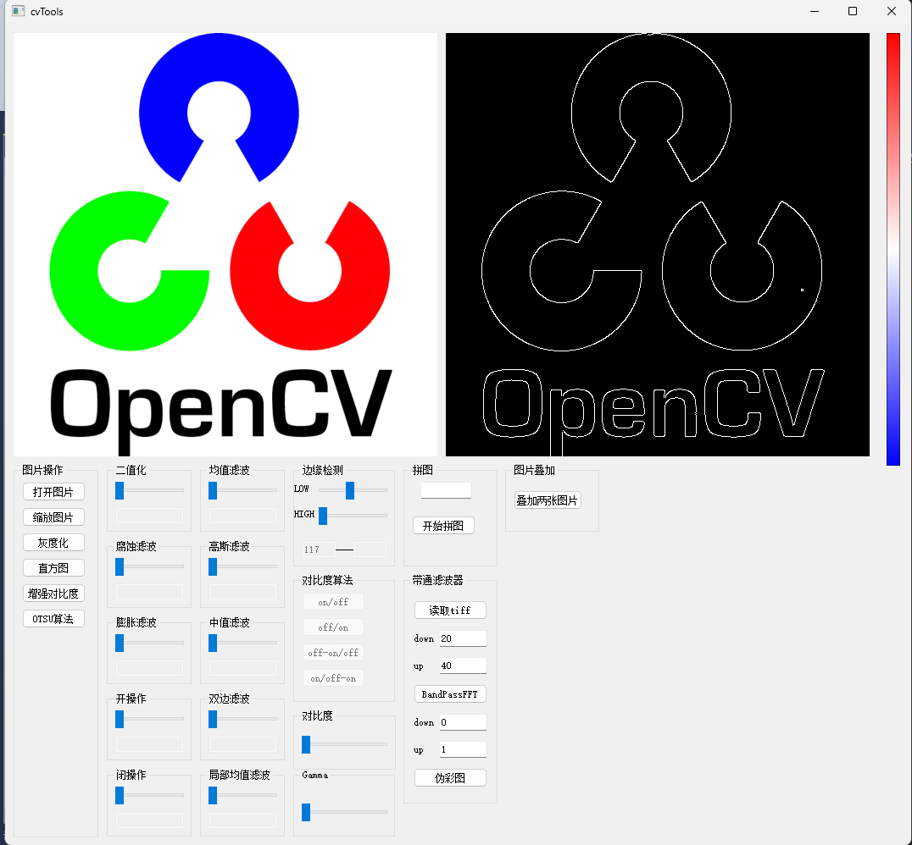

# cvTools
 opencv c++ tools
 详细查看我的b站，bilibili：https://space.bilibili.com/413302841?spm_id_from=333.1296.0.0
1.使用vistual studio 2017 与Qt Create 4.3.0架构编译，使用了opencv4.5.5库，您可以再这里下载opencv4.5.5:https://opencv.org/releases/
2.主要是对opencv一些图片滤波，高斯滤波，灰度化，增强对比度...应用测试，可以帮助新手来熟悉opencv
3.